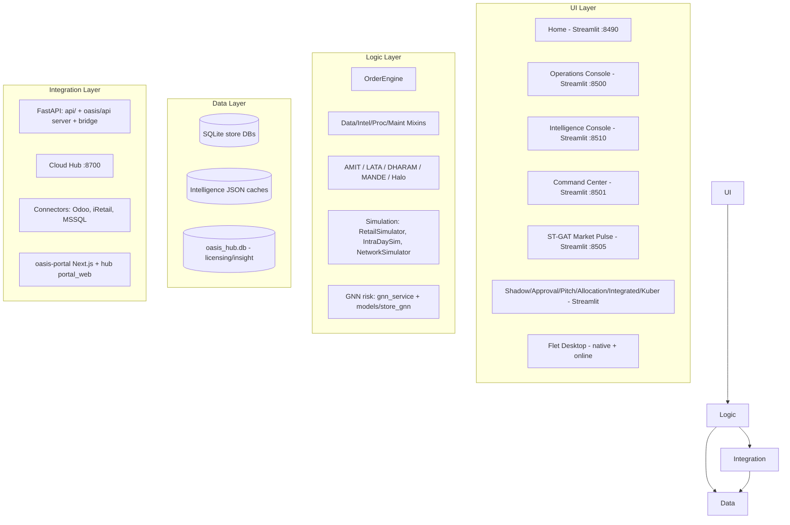

# O.A.S.I.S. — Full-System Health Check & Architecture Review

**Date:** 2026-08-01
**Scope:** the entire working tree at `C:\Users\iLink\.gemini\antigravity\scratch`
**Method:** static read-only analysis — every launcher, entry-point, module, schema, DB,
and test surface examined. No code was changed.
**Supersedes / consolidates:** `OASIS_Systems_Exhaustive_Analysis.md` (2026-06-17),
`OASIS_Deep_System_Analysis.md`, `OASIS_Systems_Deep_Analysis.md`,
`OASIS_Systems_Analysis_PostSHA.md`, and `OASIS_DEEP_ANALYSIS_2026-07-25.md`.
This document is the single consolidated record: **system definition + all findings**,
with prior findings marked **OPEN / FIXED / PARTIAL** against the 2026-08-01 tree.

---

# PART I — SYSTEM DEFINITION

## I.1 What O.A.S.I.S. is

**O.A.S.I.S.** (Optimized Acquisition & Stock Intelligence System) is a retail
procurement / stock-intelligence platform built for supermarkets (target: Kenyan
retail, Chandarana/RHAPTA-style networks). It ingests POS/ERP data, computes per-SKU
replenishment orders, allocates stock across a store network, scores suppliers,
detects dead stock and "ghost demand," and (in later phases) places real purchase
orders.

The product is sold as a licensed, on-prem Windows release (a zip the client unzips),
with an optional cloud "Hub" for licensing issuance and a two-sided supplier
intelligence exchange, plus a network-intelligence layer built on a Graph Neural
Network (GNN).

## I.2 Deployment lifecycle (the 7 phases)

```
Phase 0        Phase 1         Phase 2         Phase 3          Phase 4         Phase 5         Phase 6
THE PITCH  →  INSTALLATION  →  DATA FEED  →  UNIVERSE INIT  →  SHADOW MODE  →  TRANSITION  →  FULL AUTONOMY
(Your team)   (Client site)   (Client IT)    (OASIS engine)   (30-90 days)   (Approval)     (Engine runs solo)
```

1. **Phase 0 — Pitch:** `integrated_app.py` / `pitch_app_v2.py` ingest a sample CSV and
   produce a forensic diagnostic (AMIT dead-stock report, DHARAM ghost-demand map,
   LATA supplier risk, projected ROI).
2. **Phase 1 — Install:** `install.bat` creates the venv, installs deps, initializes the
   DB, drops directories.
3. **Phase 2 — Data feed:** client IT supplies CSVs (`Full_Product_Allocation_Scorecard.csv`
   is the master file) or grants SQL access; `MssqlConnector` / `DataGateway` pull the data.
4. **Phase 3 — Universe init:** `oasis_bootstrap.py` / `--mode bootstrap` builds the SKU
   universe, 90-day sales history, GRN history; engine warm-up runs AMIT / LATA / DHARAM.
5. **Phase 4 — Shadow mode:** the daily pipeline generates *shadow* POs; `ShadowModeEngine`
   compares OASIS POs vs human POs.
6. **Phase 5 — Transition:** results presented; `engines.shadow_mode` flipped to `false`.
7. **Phase 6 — Full autonomy:** real POs; pushed to ERP (SQL pathway) or written as CSVs
   (file pathway); the Approval Dashboard reviews lines before dispatch.

## I.3 System map (layers)



## I.4 Launch topology

### I.4.1 Root `.bat` launchers (13 live)

| Launcher | Runs (file:line) | Target | Health |
|---|---|---|---|
| `OASIS.bat` | Menu → `entrypoint.py --mode desktop|home|shell|intel|dashboard --dashboard command|dashboard --dashboard stgat|hub|serve|license-status` | 9 options | Healthy (see N-1 for option 0) |
| `install.bat` | venv + pip + `entrypoint.py --mode license-status` | Installer | Healthy |
| `serve.bat` | `entrypoint.py --mode serve` | Supervisor service | Healthy |
| `register_service.bat` | `schtasks /create … serve.bat` | Task Scheduler | Healthy |
| `unregister_service.bat` | `schtasks /delete /tn "OASIS Service"` | Remove service | Healthy |
| `run_oasis_home.bat` | `--mode home` | Home :8490 | Healthy |
| `run_oasis_live.bat` | `--mode shell` | Operations :8500 | Healthy |
| `run_oasis_intel_live.bat` | `--mode intel` | Intelligence :8510 | Healthy |
| `run_command_center_live.bat` | `--mode dashboard --dashboard command` | Command Center :8501 | Healthy |
| `run_command_center_multi.bat` | same, multi-store DB | Command Center :8501 | Healthy |
| `run_market_intelligence_tool.bat` | `--mode dashboard --dashboard stgat` | ST-GAT :8505 | Healthy |
| `run_mock_pos.bat` | setup modes then `--mode pos-stream` | POS stream (single) | Healthy |
| `run_multi_pos.bat` | setup modes then `--mode multi-pos-stream` | POS stream (5 stores) | Healthy |

33 more `.bat` files are archived under `scripts/archive/launchers/` (dead — no wiring).

### I.4.2 `entrypoint.py` — 52 `--mode` values

| # | Mode | Dispatches to | Category |
|---|---|---|---|
| 1 | `full` | engine thread + all 8 `DASHBOARD_MAP` apps + 3 modern consoles | UI (meta) |
| 2 | `engine` | `OasisScheduler` + FileWatcher + Heartbeat | Service |
| 3 | `dashboard` | `streamlit run <DASHBOARD_MAP[name]>` | UI |
| 4 | `showcase` | demo DB + `run_dashboard("command")` | UI (demo) |
| 5 | `shadow` | shadow daemon + `run_dashboard("shadow")` | UI + daemon |
| 6 | `simulation` | `run_simulation_scenario.py` subprocess | CLI |
| 7 | `desktop` | `python -m oasis.main` (LEGACY — see N-1) | UI (Flet) |
| 8 | `bootstrap` | `DataGateway.bootstrap_retail_universe` | CLI |
| 9 | `api` | `uvicorn oasis.api.server:app` :8550 | Service |
| 10 | `bridge` | `uvicorn oasis.api.bridge:app` :8600 | Service |
| 11 | `hub` | `uvicorn oasis_hub.app:app` :8700 | Service |
| 12 | `migrate` | alembic upgrade head | CLI |
| 13 | `shell` | `streamlit run app.py` :8500 | UI |
| 14 | `intel` | `streamlit run app_intel.py` :8510 | UI |
| 15 | `preflight` | `run_preflight()` | CLI |
| 16 | `build-views` | client_schema view DDL | CLI |
| 17 | `bootstrap-intel` | `bootstrap_intelligence` | CLI |
| 18 | `bootstrap-governance` | `run_governance` | CLI |
| 19 | `build-graph` | GNN graph export | CLI |
| 20 | `build-store-graph` | store graph export | CLI |
| 21 | `build-baskets` | basket affinity | CLI |
| 22 | `build-prior` | vault dept prior | CLI |
| 23 | `build-pos-db` | `build_from_xlsx` + history seed | CLI |
| 24 | `seed-history` | `seed_demand_history` | CLI |
| 25 | `seed-real-demand` | `seed_real_demand_from_files` | CLI |
| 26 | `pos-sim` | `run_simulator` | CLI (POS) |
| 27 | `pos-stream` | `stream_realtime` | CLI (POS) |
| 28 | `pos-inject` | `run_injector` | CLI (POS) |
| 29 | `build-multi-store-db` | 5-store build | CLI |
| 30 | `seed-multi-history` | multi-store history | CLI |
| 31 | `multi-pos-stream` | `stream_multi_store` | CLI (POS) |
| 32 | `issue-license` | `OfflineLicenseManager.issue` | CLI |
| 33 | `license-status` | license table | CLI |
| 34 | `backup` | `backup_db` | CLI |
| 35 | `restore` | `restore_db` | CLI |
| 36 | `set-password` | password update | CLI |
| 37 | `package-release` | `build_release` | CLI |
| 38 | `set-branding` | branding save | CLI |
| 39 | `show-branding` | branding read | CLI |
| 40 | `init` | `init_install(profile)` | CLI |
| 41 | `value-report` | `write_value_report` | CLI |
| 42 | `metering-report` | `usage_summary` | CLI |
| 43 | `home` | `streamlit run home_app.py` :8490 | UI |
| 44 | `version` | prints version | CLI |
| 45 | `upgrade` | backup + migrate + preflight | CLI |
| 46 | `assess` | Day-0 assessment | CLI |
| 47 | `supplier-scorecard` | `write_scorecard` | CLI |
| 48 | `category-report` | `write_category_report` | CLI |
| 49 | `inject-grn-costs` | `inject_from_files` | CLI |
| 50 | `sku-deepdive` | `write_sku_deepdive` | CLI |
| 51 | `push-insights` | `insight_push.run` | CLI |
| 52 | `serve` | `Supervisor().run_forever()` | Service |

> Note: the module docstring (entrypoint.py:6-21) documents 7 modes; the 2026-07-25
> analysis claimed 56; the parser actually accepts **52**.

### I.4.3 UI apps

| File | Type | Port | Provides | Launched by |
|---|---|---|---|---|
| `home_app.py` | Streamlit | 8490 | Suite launcher / first-run wizard / license posture | `--mode home` |
| `app.py` | Streamlit | 8500 | Operations Console (9-page registry via `oasis.ui.shell`) | `--mode shell` |
| `app_intel.py` | Streamlit | 8510 | Intelligence Console (7-page monitoring registry) | `--mode intel` |
| `ops_dashboard.py` | Streamlit | 8501 | Command Center — 11 tabs, GNN risk, intraday sim | `--dashboard ops\|command` |
| `shadow_dashboard.py` | Streamlit | 8502 | Shadow Audit Hub | `--mode shadow` |
| `approval_dashboard.py` | Streamlit | 8503 | PO Approval Center | `--dashboard approval` |
| `pitch_app_v2.py` | Streamlit | 8504 | Operations Forensic Audit | `--dashboard pitch` |
| `st_gat_dashboard.py` | Streamlit | 8505 | ST-GAT Market Pulse (GNN, expansion) | `--dashboard stgat` |
| `allocation_app.py` | Streamlit | 8506 | Inventory Allocation Engine | `--dashboard allocation` |
| `integrated_app.py` | Streamlit | 8507 | OASIS Retail Lifecycle (3-tab wizard) | `--dashboard integrated` |
| `pitch_app.py` | Streamlit | — | Pitch Engine v1 | **orphan** |
| `streamlit_app.py` | Streamlit | — | Retail Simulation | **orphan** |
| `kuber_terminal.py` | Streamlit | — | KUBER Financial Terminal | **orphan** |
| `pages/1..4_Phase_*.py` | Streamlit multipage | auto | "Mosaic" phase stubs | auto-attached to every console (N-5) |
| `oasis/main.py` | Flet | — | Legacy order processor | `--mode desktop` (N-1) |
| `oasis/desktop/app.py` | Flet | — | New Phase-1 desktop shell | **orphan** (N-1) |
| `oasis/main_online.py` | Flet web | 8550 | OASIS Online Terminal | **orphan** + port collision (N-6) |
| `oasis_hub/app.py` + portal_web | FastAPI + static | 8700 | Cloud Hub + supplier portal | `--mode hub` |
| `oasis-portal/` | Next.js | 3000 | Supplier portal (2nd implementation) | **orphan** |

### I.4.4 Services

| Service | Port | Entry |
|---|---|---|
| `oasis.api.server` (Mobile API) | 8550 | `--mode api` |
| `oasis.api.bridge` (Manager Bridge) | 8600 | `--mode bridge` |
| `oasis_hub.app` (Cloud Hub) | 8700 | `--mode hub` |
| `api/main.py` (Command & Control gateway) | 8000 | direct `python api/main.py` (no entrypoint mode) |
| `api/master_hub_api.py` (Master Control Hub) | 8000 | direct `python` (no entrypoint mode) |
| Supervisor (serve) | — | `--mode serve` |
| Engine (scheduler+watcher+heartbeat) | — | `--mode engine` |
| `vj_canvas/backend/main.py` | 8000 | orphan (audio separator) |

## I.5 Data topology

### I.5.1 Databases present (2026-08-01)

| File | Size | Journal | Tables | Role |
|---|---|---|---|---|
| `oasis/data/rhapta_multi_store.db` | 4.3 MB | WAL | 20 | **ACTIVE store** (5 stores, 34 SKUs) per `.oasis_onboarding.json` |
| `oasis/data/rhapta_pos.db` | 35.9 MB | WAL | 20 | Single-store build, 39,728 items |
| `oasis/data/mock_pos_erp.db` | 245 MB | WAL | 21 | Default `OASIS_DB_URL` fallback; has sessions, users, 14 orgs |
| `oasis/data/mock_pos_erp_lite.db` | 41 MB | WAL | 13 | POS-only (5,000 items); ops_dashboard fallback |
| `oasis/data/mock_pos_erp_showcase.db` | 123 MB | WAL | 21 | Showcase mode |
| `oasis.db` (root) | 41 KB | WAL | 5 | cwd-default orphan (D-7) |
| `oasis_hub.db` | 168 KB | **delete** | 11 | Hub DB (only delete-mode journal) |
| `x.db` | 0 B | delete | 0 | empty stray file |
| `oasis/data/backups/*` | — | WAL | 20–21 | historical backups |
| `sandbox/oasis.db`, `test_oasis/oasis.db` | 41 KB | WAL | 5 | ensure-built 5-table shapes |
| `tests/test_mock_pos_erp.db` | 309 MB | WAL | 20 | test artifact |
| `Allocation_Engine_Release/…`, `oasis_checkpoint_before_refactor/…` | ~245/41/123 MB | WAL | — | stale release/copy snapshots |

### I.5.2 Schema-defining sources (the "single source of truth" problem)

| Source | Location | Table set | Notes |
|---|---|---|---|
| POS builder DDL | `oasis/logic/mock_pos_erp.py:37-339` `SCHEMA_SQL` | **20 tables, no OASIS_SESSIONS** | mirrors RXL SQL Server |
| OASIS runtime DDL | `oasis/logic/db_connector.py:404-470` `ensure_oasis_tables` | **5 tables** | **missing INTEGRATION_PURCHASE_ORDERS** |
| ORM "source of truth" | `oasis/models.py` | 21 tables | OASIS_SESSIONS = SESSION_TOKEN variant |
| Alembic baseline | `migrations/versions/001_baseline_schema.py` | 21 tables | matches models.py, not runtime |
| Hub schema | `oasis_hub/models.py` + `oasis_hub/db.py` | 11 hub tables | `create_all`, no alembic |
| Canonical POS contract | `oasis/logic/preflight.py:25-43` | REQUIRED+RECOMMENDED+OASIS store tables | validation only |

**OASIS_SESSIONS has four different definitions:**
`models.py`/migration = `SESSION_TOKEN` PK + IP_ADDRESS;
`ensure_oasis_tables` + actual DBs + `auth_manager.py:314` = `SESSION_ID` + IS_REVOKED;
SCHEMA_SQL-built DBs = **no table at all** (D-1).

### I.5.3 DB-resolution priority chains

| Chain | Precedence | Resolves to today |
|---|---|---|
| `onboarding.resolved_db_path()` (active store) | `OASIS_DB_PATH` → onboarding `db_path` → connected sqlite URL → install profile → `rhapta_pos.db` | `rhapta_multi_store.db` |
| `db.get_db_url()` (operational store) | `OASIS_DB_URL` → `OASIS_DB_PATH` → `mock_pos_erp.db` | `mock_pos_erp.db` |
| `db.get_pos_db_url()` (POS source) | `OASIS_POS_DB_URL` → onboarding connect URL → `get_db_url()` | `mock_pos_erp.db` |
| data_gateway / heartbeat | `cwd/oasis.db` | root `oasis.db` (diverges, D-7) |
| API auth (`oasis/api/security.py:38-42`) | `OASIS_DB_PATH` → `mock_pos_erp.db` | `mock_pos_erp.db` |
| ops_dashboard | `OASIS_DB_PATH` → `mock_pos_erp.db` → `_lite.db` | `mock_pos_erp.db` |
| Hub | `OASIS_HUB_DB_URL` → `sqlite:///oasis_hub.db` (cwd) | root `oasis_hub.db` |

## I.6 Core engine stack (module → role → data flow)

| Module | Role | Data flow |
|---|---|---|
| `order_engine.py` (657) | Orchestrator; ROP pipeline; safety cap 30d coverage | scorecard → guards → mixins → POs |
| `procurement_mixin.py` (1379) | Post-processing; budget split → wallets; skip-audit reasons | per-department wallets |
| `intelligence_mixin.py` | ROP intelligence; priority tiers 0–3; target coverage; v10.12 strict 1.2d fresh | tier sort by `(-ads)`, safety_pct 20/15/10 |
| `data_mixin.py` | Picking-list parsing; GRN harvest; `grn_frequency = 1.0/avg_gap` | RXL picking list layout |
| `allocation_strategies.py` | Multi-pass budget allocation; `AllocationConfig` | pass1 0.85/0.70, reserves, staple shares, MOV |
| `order_logic_guards.py` | Guards pre-rounding; `effective_daily_sales = 0.7·30d + 0.3·ADS` | greenfield uses 100% ADS |
| `rounding.py` | Pack rounding; ABC overage A=0.40/B=0.20/C=0.05 | round-UP bias; Minimum 1 Pack |
| `budget_manager.py` | Wallet init; staple check (Golden File + heuristic) | zero-weight minimums |
| `store_profile_manager.py` | Store tiers; budget keyframes 0/200K/1M/10M/50M | MDQ snapped to [2,3,4,6,12,24] |
| `consolidated_transfer_service.py` | Cross-store transfer optimization; `optimize_network` | PULL/PUSH plans, `manual_only` fresh |
| `db_connector.py` | DB access with retry; `SchemaMapper`; `SM_WAC→wac` | SQLAlchemy engine |
| `lata_shield.py` | Supplier reliability multiplier (variance ratio bands) | vr>0.30 → up to 2.0; vr<0.05 → down to 0.80 |
| `amit_gatekeeper.py` / `amit_governance.py` | Dead-stock governance / blacklist | nodes/edges from `nodes.csv`/`edges.csv` |
| `dharam_revenue.py` | Ghost-demand / cross-sell lift patches | affinity map |
| `mande_triage.py` | Supplier/manufacturer triage | config-gated |
| `halo_pricing.py` | Price halo analysis | config-gated |
| `risk_baseline.py` / `risk_features.py` | Probabilistic risk (Acklam inverse-normal + Poisson tail) | `daily_demand_sigma = max(ads·cv, √ads)` |
| `gnn_service.py` + `models/store_gnn.py` + `models/train_store_gnn.py` | GNN store risk | symmetric-norm GCNConv; `risk = so·1.5 + crit·0.5` |
| `oasis/simulation/simulation_bridge.py` | Live/sim/greenfield entry; `OASIS_ROP_MODE` envs | heuristic|newsvendor modes |
| `oasis/simulation/data_loader.py` (223) | Seasonal provider; `*_cash.xlsx`; NOV=1.0/DEC=1.25 fallbacks | item trends capped 0.5–2.0 |
| `stores_network.json` | GNN graph source | 14-store Chandarana network |

**Chapter-11 engine layer** (AMIT/LATA/DHARAM/MANDE) is feature-flagged via
`oasis/data/oasis_engines_config.json`, consumed by `order_engine.py:78-109`
(`is_engine_enabled` reads `engines.get(name,{}).get('enabled', False)`) and each
engine module. `engines_config.py` now provides two-tier `candidate_paths()` lookup
with `PARAM_ONLY_SECTIONS` and `KNOWN_ENGINES = ("mop_up","amit","lata","dharam","mande")`.

## I.7 Integration surface

| # | Surface | Framework | Routes | Auth | Consumed by |
|---|---|---|---|---|---|
| 1 | `api/main.py` gateway | FastAPI | 5 mounted routers + `/health` | **none** | `integrated_app.py:67` only (one route) |
| 2 | `api/routers/pitch.py` | FastAPI | /status, /audit/rhapta, /audit/custom, /export | none | **nobody** |
| 3 | `api/routers/shadow.py` | FastAPI | /metrics | none | **nobody** |
| 4 | `api/routers/stgat.py` | FastAPI | /simulate | none | **nobody** |
| 5 | `api/routers/allocation.py` | FastAPI | /simulate | none | **nobody** |
| 6 | `api/routers/operations.py` | FastAPI | /stores, /register, /pipeline, /po | none | `integrated_app.py:67` |
| 7 | `api/master_hub_api.py` | FastAPI | /pulse, /nodes | none | `oasis/logic/pulse_sync.py:85` |
| 8 | `oasis/api/server.py` :8550 | FastAPI | /, /status, /upload, /results, /download | API key | `oasis/api/static/app.js` |
| 9 | `oasis/api/bridge.py` :8600 | FastAPI | 13 endpoints (/orders/*, /erp/*, /ingest, /alerts) | API key + license | **nobody** (tests only) |
| 10 | `oasis_hub/app.py` :8700 | FastAPI | /admin, /ingest, /portal | Admin/Token/Sess | `connectors/odoo/*`, `insight_push.py`, portal |
| 11 | `oasis_hub/routers/admin.py` | FastAPI | tenants, stores, tokens, suppliers, consent, tiers, licenses | X-Hub-Admin-Key | `bootstrap_hub.py` |
| 12 | `oasis_hub/routers/ingest.py` | FastAPI | /movements, /insights | Bearer store token | push_client, insight_push |
| 13 | `oasis_hub/routers/portal.py` | FastAPI | /login, /movements, /overview, /insights, /offers | Bearer supplier session | portal_web |

**Hub ↔ client contract:** provisioning via admin key (raw ingest token returned once,
only SHA-256 stored); movements idempotent on `(store_id, source_ref)`; insights
idempotent on `(store_id, supplier_id, kind, source_ref)`; visibility default-deny
(`visibility.py`: ownership rule AND consent granted; `reveal_identity=False` masks to
HMAC handles); insight exposure default-deny until `/admin/insight-exposure` sets
visible; tier model FREE_KINDS / PREMIUM_KINDS / FLEX_KINDS; licensing is hub-issued
signed keys verified fully offline.

**Outbound:** `pulse_sync` → master_hub_api :8000; `insight_push` → hub /ingest/insights;
Odoo push_client → /ingest/movements; `bootstrap_hub` → /admin/*; supervisor → webhook;
`oasis/api/server.py` requires `ANTHROPIC_API_KEY` for upload analysis.

## I.8 Test surface

- `tests/` directory: 96 files (87 with `def test_*`), **914 test functions**.
- Root `test_*.py`: 16 files, 11 functions.
- **Total ≈ 925 test functions** (excluding `test_oasis/`).
- Coverage is unit-level on `oasis.logic.*`. **No test imports any Streamlit app**
  (dashboards call `st.set_page_config` at import → untestable by construction).
- Largest suites: `test_math_validation` (33), `test_ui_library` (29),
  `test_auth_and_audit` (26), `test_intel` (22), `test_replenishment_logic` (22),
  `test_gnn_service` (22), `test_pos_erp_integration` (20).
- 9 test files assert at import time rather than defining pytest functions
  (`test_fresh_logic`, `test_gap11_flex_pool`, `simulate_ai_impact`,
  `simulate_smart_depth`, `test_expiry_and_summary`, `test_new_product_logic`,
  `test_transfer_order_sync`, `test_velocity_booster`).

---

# PART II — THE FINDINGS

## II.1 Findings index

| ID | Severity | Status | One-line summary | Where it bites |
|---|---|---|---|---|
| L-1 | High | **FIXED** | `run_stgat.bat` bare `python` on Streamlit script | launcher |
| CC-A | Low | OPEN | guest fail-open fallback in Command Center | latent |
| CC-B | Med | OPEN | NotificationService/Scheduler only in Command Center | utilization |
| CC-C | Med | OPEN | Executive ROI tab is hard-coded theater | sales surface |
| CC-D | High | OPEN | Sim Lab "GNN-Adjusted" run never receives the GNN score → identical to heuristic | demo integrity |
| CC-E | High | OPEN | Analytics PO query reads wrong table → PO KPI always 0 | analytics |
| CC-F | Med | OPEN | per-click engine construction in two tabs | perf |
| CC-G | Med | OPEN | 3,433-line monolith with logic inside view blocks | testability |
| MI-A | Med | OPEN | GNN 29→30 weight zero-pad band-aid | fragile model load |
| MI-B | High | OPEN | silent random-init GNN fallback renders confident scores | trust |
| MI-C | Med | OPEN | "Attention Arcs" = identity matrix | viz integrity |
| MI-D | High | OPEN | "Commit Transfers" only toasts, no DB write | fake dispatch |
| MI-E | Med | OPEN | GNN/agent/expansion siloed in one file | reusability |
| SH-A | Med | OPEN | shell ordering omits `gnn_risk_score` | safety stock |
| SH-B | Med | OPEN | `journey_state.value_recovered` never fed real numbers | value meter |
| SH-C | Med | OPEN | Intel console reimplements velocity alerts; no GNN | duplication |
| FL-A | Low | OPEN | Flet desktop has no auth | inconsistent |
| FL-B | Med | OPEN | 4th ingestion path | duplication |
| S1 | **Ship-blocking** | **FIXED** | engine config excluded from release twice | every install |
| S2 | High | OPEN | "Connect a POS" never reaches the consoles | first hour |
| S3 | High | OPEN | 2 of 5 onboarding buttons fail on clean zip | first screen |
| S4 | High | OPEN | `apply_init` writes `source="init"`, unknown to SOURCES/badge/trial | catalogue installs |
| S5 | High | **FIXED** | Command Center outside suite login + SSO | every console hop |
| S6 | Med | **FIXED** | suite bar doesn't know which console it's in | navigation |
| S7 | Med | OPEN | Home ignores `resolved_db_path()` | Home + Start All |
| S8 | Med | **PARTIAL** | supplier insight cards unemitted (was 8; now only `quality` kind) | supplier value |
| S9 | Med | OPEN | ~11 CLI modes have no UI affordance | discoverability |
| S10 | Low | **FIXED** | installer closing instructions drift | first impression |
| S11 | Med | OPEN | module-level dead code: ai_employee, pulse_sync, simulation_pipeline (partially) | surface area |
| N-1 | High | NEW/OPEN | `run_desktop` defined twice; legacy wins; new shell orphaned | desktop launch |
| N-2 | High | NEW/OPEN | `--mode shadow`/`showcase` resolve ops port 8501 | port conflict |
| N-3 | Med | NEW/OPEN | `--mode full` double-launches ops_dashboard (3 "Operations" processes) | process bloat |
| N-4 | High | NEW/OPEN | Dockerfile copies non-existent file; dashboards not found in image | container build/run |
| N-5 | Med | NEW/OPEN | `pages/` auto-multipage leaks into every console; :8000 ping | sidebar pollution |
| N-6 | Med | NEW/OPEN | `main_online.py` hardcodes 8550 → collides with API | port conflict |
| N-7 | Med | NEW/OPEN | supervisor never starts ST-GAT while Home advertises it | missing surface |
| N-8 | Low | NEW/OPEN | entrypoint docstring + prior docs stale on mode count (52) | documentation |
| N-9 | Med | NEW/OPEN | ~20 CLI modes have no launcher/menu entry | discoverability |
| N-10 | Med | NEW/OPEN | 6 of 8 dashboard keys unreachable via launcher | discoverability |
| D-1 | **High** | NEW/OPEN | active store has no OASIS_SESSIONS → SSO/bearer silently fail | auth on store |
| D-2 | High | NEW/OPEN | `ensure_oasis_tables` omits INTEGRATION_PURCHASE_ORDERS → PO write-back raises | PO push |
| D-3 | **High** | NEW/OPEN | scheduler jobs pass plain path to UniversalConnector → all 3 jobs fail | daily pipeline |
| D-4 | Med | NEW/OPEN | OASIS_SESSIONS has 4 divergent definitions | migration drift |
| D-5 | Med | NEW/OPEN | OASIS_USERS role CHECK lags role model → 4 seeds rejected | roles missing |
| D-6 | Med | NEW/OPEN | failed-login lockout columns absent on active store → no-op | security |
| D-7 | Med | NEW/OPEN | root `oasis.db` orphan diverges from resolved store | fragmentation |
| D-8 | Med | NEW/OPEN | Command Center vs shells may read different DBs | data inconsistency |
| D-9 | Low | NEW/OPEN | hub DB is only delete-mode journal | concurrency |
| D-10 | Med | NEW/OPEN | two disconnected API layers | integration |
| E-1 | Med | NEW/OPEN | `max_overage_ratio=0.25` inert; 3 inconsistent stockout definitions | logic inconsistency |
| E-2 | Med | NEW/OPEN | fresh-coverage diverges by path (1.2d vs 3.0d) | order variation |
| E-3 | Med | NEW/OPEN | two parsers for `*_cash.xlsx` with divergent header heuristics | silent seasonality ~1.0 |
| E-4 | Low | NEW/OPEN | alert 14-day baseline drift vs other 14-day semantics | alert mismatch |
| E-5 | Low | NEW/OPEN | cost fallback 0.75×selling duplicated 5× | single-source violation |
| E-6 | High | NEW/OPEN | 45+ stale `from app.logic` imports (no `app/` dir) | broken dev scripts |
| F-1 | Med | NEW/OPEN | `api/` gateway orphaned (no consumers) | dead surface |
| F-2 | Med | NEW/OPEN | `oasis/api/bridge.py` 13 endpoints, no consumers | dead surface |
| F-3 | Med | NEW/OPEN | `master_hub_api` no entrypoint; pulse_sync targets :8000 | dead integration |
| F-4 | Med | NEW/OPEN | `api/routers/shadow.py` reads wrong shadow_logs path → always empty | API wrong data |
| F-5 | Med | NEW/OPEN | `bridge.py` loads nonexistent `sales_intelligence_2025.json` | API wrong data |
| F-6 | Med | NEW/OPEN | `api/main.py` CORS `*` + credentials | security |
| F-7 | High | NEW/OPEN | `api/` gateway zero auth on mutating endpoints | security |
| F-8 | Med | NEW/OPEN | hard-coded demo creds in bootstrap_hub.py as env fallback | security |
| F-9 | Low | NEW/OPEN | ephemeral secret fallback logs keys | security |
| U-1 | Med | NEW/OPEN | `dist_release/` ships compiled dead module + older dashboard snapshot | release integrity |
| U-2 | Med | NEW/OPEN | shell bridge pages retired; ~10 legacy dashboards coexist un-bridged | duplication |
| U-3 | Med | NEW/OPEN | 4 un-gated Streamlit apps remain | security |
| U-4 | Med | NEW/OPEN | NotificationService + Scheduler panel only in ops_dashboard | utilization |

## II.2 A — Launcher & process-topology findings (detailed)

### L-1 — (FIXED) bare-python launcher for a Streamlit script
`run_stgat.bat` (2026-06-17 line 3) ran `python st_gat_dashboard.py` directly. Under
bare Python every `st.*` call emits "missing ScriptRunContext" warnings and renders
nothing. **Fixed:** archived `scripts\archive\launchers\run_stgat.bat` now routes via
`entrypoint.py --mode dashboard --dashboard stgat`; the live path is
`run_market_intelligence_tool.bat`.

### N-1 — (NEW, High) `run_desktop()` defined twice; the legacy app wins
`entrypoint.py:364-382` defines `run_desktop()` that launches the Phase-1 Flet shell
(`oasis.desktop.app`); `entrypoint.py:516-521` **redefines** it to run
`python -m oasis.main` (the legacy 182-line file-picker app). The second definition
silently overrides the first, so `--mode desktop`, `OASIS.bat` option 0, and
`run_app.bat` all launch the legacy app. `oasis/desktop/app.py:7-9` docstring claims
`entrypoint.py --mode desktop` launches it — false today. The PyInstaller spec
(`OASIS_Offline.spec:5`) likewise builds the legacy entry.

### N-2 — (NEW, High) `--mode shadow` and `--mode showcase` inherit the ops port
`main()` computes the port from `DEFAULT_PORTS.get(args.dashboard, 8501)` where
`--dashboard` defaults to `"ops"` (entrypoint.py:647-651, :584-585). So
`--mode shadow` passes 8501 (not 8502/8506) to `run_shadow_full`, and `--mode showcase`
passes 8501 (not 8505) to `run_showcase`. The shadow dashboard can occupy the Command
Center's port. The `port=8506` / `port=8505` defaults in the signatures are dead.

### N-3 — (NEW, Med) `--mode full` launches the same dashboard twice
`run_full` iterates every entry in `DASHBOARD_MAP` (entrypoint.py:403-418), which
contains both `"ops"` and `"command"` → both map to `ops_dashboard.py` (entrypoint.py:48,52)
→ `ops_dashboard.py` starts twice (ports 8501/8502), and the `modern_consoles` block
(:421-425) adds `app.py` labelled `"ops"` on 8500. Result: three processes for one
product area.

### N-4 — (NEW, High) Docker image cannot run any dashboard
- `Dockerfile:71` does `COPY command_center.py /app/dashboards/` — `command_center.py`
  **does not exist** in the repo → the image build fails at that step.
- Even if it built, dashboards are copied to `/app/dashboards/` (Dockerfile:66-76)
  while `run_dashboard` checks bare filenames in CWD `/app/` (entrypoint.py:171-173) →
  every dashboard "not found"; `run_full` silently `continue`s past them (:404-405).
- `app.py`, `app_intel.py`, `home_app.py`, `pitch_app_v2.py`, `kuber_terminal.py` are
  not copied into the image at all → `--mode shell/intel/home` and `pitch`/`kuber`
  cannot run in-container. `integrated_app.py` is copied to `/app/flet_app/` (Dockerfile:75).
- docker-compose maps every dashboard container to internal port 8501
  (docker-compose.yml:112,131,150,169,188,207).

### N-5 — (NEW, Med) Streamlit auto-multipage leak
Every launcher `cd`s to project root and `entrypoint.py` runs `streamlit run <script>`
with relative names, so CWD is always the root — Streamlit auto-discovers
`pages/1..4_Phase_*.py` and injects them into the sidebar of **every** console. The
four Phase pages are unauthenticated placeholders; Phase 1 calls
`http://localhost:8000/api/v1/pitch/audit/rhapta` (pages\1_Phase_1_Pitch_Audit.py:22-25)
— a port occupied only by the unrelated `vj_canvas\backend\main.py`. The referenced
`pitch-diagnostic-engine` mosaic microservice does not exist as an OASIS service.

### N-6 — (NEW, Med) Flet-web port collision
`oasis/main_online.py:173` sets `port = 8550` and :184-186 runs `ft.app(view=WEB_BROWSER,
port=8550)`; `--mode api` also defaults to 8550 (entrypoint.py:194-199, :680).
Launching both clobbers one.

### N-7 — (NEW, Med) Supervisor never starts ST-GAT
`DEFAULT_SERVICES = ("home", "ops", "command", "intel")` (oasis/logic/supervisor.py:35);
only `hub` is conditionally added (:50-54). Home's `CONSOLES` advertises 5 surfaces
including ST-GAT (oasis/ui/home.py:21-33), but `serve.bat`/`register_service.bat` will
never bring Market Intelligence up.

### N-8 — (NEW, Low) stale mode counts
`entrypoint.py:6-21` documents 7 modes; the 2026-07-25 doc claims 56; the parser
accepts **52** (entrypoint.py:563-583). Also `install.bat:95-97` now *does* mention
`serve.bat`/`register_service.bat`, partially resolving old S10.

### N-9 — (NEW, Med) CLI-only modes with no affordance
Beyond the 11 named in S9, these `--mode`s have no `.bat` or menu entry:
`showcase`, `simulation`, `preflight`, `build-views`, `bootstrap-intel`,
`bootstrap-governance`, `build-graph`, `build-store-graph`, `build-baskets`, `pos-sim`,
`pos-inject`, `seed-history`, `inject-grn-costs`, `push-insights`, `package-release`,
`set-branding`, `show-branding`, `metering-report`, `restore`, `init`. `shadow` and the
`approval/allocation/integrated/pitch` dashboards are reachable only via CLI.

### N-10 — (NEW, Med) dashboard keys unreachable via launcher
Of the 8 `DASHBOARD_MAP` keys, only `command` and `stgat` have root `.bat` launchers.
`shadow`, `approval`, `pitch`, `allocation`, `integrated`, and `ops` are reachable only
through `OASIS.bat` option 2 (which is `app.py`, not `ops_dashboard.py`), the
supervisor, or raw CLI.

### Duplicate/overlapping modes (structural)
- `ops` ↔ `command` dashboard keys → same file (entrypoint.py:48, :52).
- `shell` (app.py) ↔ `dashboard --dashboard ops` (ops_dashboard.py) — two "Operations" apps.
- `showcase` = `command` on a demo DB.
- `pos-sim` / `pos-stream` / `pos-inject` — three single-store POS feed paths; plus `multi-pos-stream`.
- `seed-history` / `seed-real-demand` / `build-pos-db`'s internal history — overlapping seeds.

## II.3 B — UI / surface findings (detailed)

### CC-A — (OPEN, Low) guest fail-open fallback
`ops_dashboard.py:516-528`: if no user is in session it fabricates a `guest` user with
`{'tabs':{'live_sales':True}}`. On the normal path this is dead (the gate `st.stop()`s
first), but it is a latent "fail-open to live_sales" if the gate is ever bypassed.

### CC-B — (OPEN, Med) NotificationService + OasisScheduler instantiated only in the Command Center
`ops_dashboard.py:539-547`. Neither console touches them; the Scheduler Control Panel
is buried in the Command Center Settings tab (:3272-3321).

### CC-C — (OPEN, Med) Executive ROI tab is theater
`ops_dashboard.py:896-1022`: hard-coded "14,282 SKU nodes", "95.2% Inference
Confidence", "14ms Neural Latency", "4,122 SKU Affinities"; fixed baseline/optimized
arrays (:1004-1006); before/after fulfilment hard-coded except a shadow-log branch
(:953-974); "Recaptured Capital" reads a `showcase_roi_savings` config string. This is
the tab executives see first.

### CC-D — (OPEN, High) Sim Lab GNN run is a no-op
`ops_dashboard.py:2699-2706`: `gnn_risk = risk_scores_map.get(selected_org)` is computed
but never passed into the run or the bridge. Both "Heuristic" and "GNN-Adjusted"
simulators share identical `config`, `seed=42`, and `sku_states`, so the two runs are
deterministically identical. The "GNN value proposition" (:2804-2816, extrapolated
annual uplift) is therefore computed from ~zero delta.

### CC-E — (OPEN, High) Analytics PO query hits the wrong table
`ops_dashboard.py:2889`: `SELECT * FROM INTEGRATION_PO_RECOMMENDATIONS WHERE ORG_CD = :org`
— the schema and `push_purchase_order` use `INTEGRATION_PURCHASE_ORDERS`. The query is
wrapped in `try/except → po_count, po_value = 0, 0`, so the "Purchase Orders" KPI card
silently shows 0 forever.

### CC-F — (OPEN, Med) per-click engine construction
The OASIS Processor (:2365) and Sim Lab build fresh `OrderEngine`/`SimulationOrderUtil`
instances per run instead of reusing the cached `get_order_engine()`.

### CC-G — (OPEN, Med) monolith structure
`ops_dashboard.py` is 3,433 lines of straight-line script with business logic inside
`with tab:` blocks — untestable by construction (the engines it calls are tested; the
orchestration is not).

### MI-A — (OPEN, Med) GNN dimension band-aid
`st_gat_dashboard.py:95-105`: a runtime patch detects a 29-wide `temporal_lstm.weight_ih_l0`
and zero-pads it to 30 because checkpoint and model drifted. `load_state_dict(strict=False)`
masks any other mismatch.

### MI-B — (OPEN, High) silent random GNN fallback
`st_gat_dashboard.py:109-113`: on load failure it `st.warning`s and proceeds with a
**randomly-initialized GNN** that still renders confident risk scores, demand fans, and
transfer scores, with no "untrained model" guard downstream.

### MI-C — (OPEN, Med) mocked attention viz
`st_gat_dashboard.py:252`: `attn_matrix = torch.eye(len(stores))` — the GCN has no
attention heads, so "Attention Arcs" show an identity matrix.

### MI-D — (OPEN, High) fake transfer dispatch
`st_gat_dashboard.py:847`: "Commit Transfers" only does `st.sidebar.success("Dispatched
N transfers to ERP!")` — no DB write, no `push_transfer_request`.

### MI-E — (OPEN, Med) siloed intelligence
The GNN, agent sim, expansion engine, and affinity/whitespace analytics exist only in
`st_gat_dashboard.py`, exposed via no API. Hard-coded relative paths and `st.stop()`
make it brittle outside the project root.

### SH-A — (OPEN, Med) shell ordering omits GNN risk
Operations Ordering calls `calculate_order_quantity` without a `gnn_risk_score`
(shell.py) so safety stock is not risk-inflated as it is in the Command Center.

### SH-B — (OPEN, Med) `journey_state.value_recovered` never fed real numbers
The Home/Exec-ROI value meter shows 0 unless set manually. (`--mode value-report`
computes real `value_recovered` via `write_value_report` but nothing feeds the journey
state.)

### SH-C — (OPEN, Med) Intel console duplicates alert logic and skips GNN
Intelligence Console reimplements a days-cover heuristic for velocity alerts instead
of reusing `AlertMonitor`'s spike engine, and uses no GNN (Network Intel is
inventory-based).

### FL-A — (OPEN, Low) desktop has no auth
`oasis/main.py` has no authentication (single-user assumption) — inconsistent with the
gated web tier.

### FL-B — (OPEN, Med) multiple ingestion paths
`run_intelligent_analysis` (Flet), the OASIS Processor tab, `ForensicOperationsIngestor`
(pitch), `load_scorecard_recommendations` (consoles), and `greenfield_runner`'s loader
— five parsers, five code paths.

### U-2 — (NEW, Med) legacy dashboards coexist un-bridged
`oasis/ui/shell.py:924` documents bridge pages as retired; all 9 registry pages are
native. The ~10 legacy Streamlit dashboards now coexist as standalone un-bridged apps.

### U-3 — (NEW, Med) un-gated surfaces
`pitch_app.py`, `streamlit_app.py`, `pages/1_Phase_1_Pitch_Audit.py`, and the three
6-line Phase stubs have **no auth**. All other gated apps now use the unified
`oasis.ui.auth.require_login`; `ops_dashboard.py:494-509` documents removal of its
parallel login stack.

### U-4 — (NEW, Med) notification + scheduler utilization
`NotificationService` and `OasisScheduler` are instantiated only inside
`ops_dashboard.py` (:539-547); no other UI consumes `notification_service.get_active_alerts`.

## II.4 C — Client-delivery / onboarding findings (July, status)

### S1 — (FIXED) engine config never ships
Was: `oasis/data/oasis_engines_config.json` excluded from release twice
(`release_packager.py:61` blacklist `_EXCLUDE_GLOBS = "oasis/data/*.json"`; whitelist
mode `_OASIS_DATA_WHITELIST = {"supplier_calendar.py","__init__.py"}` at :107/:149-151),
so all six consumers failed soft to empty config and every Chapter-11 engine returned
False via `order_engine.is_engine_enabled()` (`order_engine.py:78-109`). **Fixed:**
`engines_config.py` now implements two-tier `candidate_paths()` lookup
[(live, caller), (live, package), (default, caller), (default, package)],
`resolve_source(exists=...)` injectable, `PARAM_ONLY_SECTIONS=("dead_stock",)`, and
`KNOWN_ENGINES`. `Dockerfile:58` still copies a third, separate root-level copy.

### S2 — (OPEN, High) "Connect a POS" is a dead end
`onboarding.py` `apply_connect` records `db_url` (:174) but `resolved_db_path()` reads
`db_path` tiers only — never `db_url` (:81-103). `db.get_pos_db_url()` returns
`os.getenv("OASIS_POS_DB_URL")` (db.py:41-49) and nothing ever writes that env var. So
after a successful connect, `app.py:25` / `app_intel.py:25` open
`oasis/data/rhapta_pos.db` — a file that on a connect-only install doesn't exist. The
wizard's own copy even tells the user to set the env var by hand
(`oasis/ui/onboarding.py:74-75`), and the provenance chip reads "DATA: connected POS
(<host>)" (:141-145) while the console reads a nonexistent local sqlite file.

### S3 — (OPEN, High) two of five onboarding paths fail on a clean zip
Five cards (`oasis/ui/onboarding.py:32-104`): Sample store ✅ (in-code `demo_seed`),
Start fresh ✅, Connect a POS ⚠️ (then S2), Build from Catalogue ❌
(`init_install` reads unshipped spreadsheets; `.xlsx/.xls/.csv` are in `_EXCLUDE_EXTS`,
`release_packager.py:53-55`), Multi-store demo ❌ (same `init_install` path). The
multi-store test monkeypatches `init_install` (`tests/test_suite_sso.py:76`), so the
test passes where the real call fails.

### S4 — (OPEN, High) `apply_init` writes an unknown source value
`SOURCES = ("demo", "empty", "connect")` (onboarding.py:29) but `apply_init` records
`"init"` (:209). Consequences: `is_onboarded()` still returns True; the data-source
badge falls to `else` → "DATA: not onboarded — run first-launch setup from Home"
(oasis/ui/onboarding.py:136-147) forever; and `apply_init` never calls
`_maybe_restart_trial` (compare `apply_empty:143`, `apply_connect:173`), so the one
real-data path never gets the 14-day trial clock.

### S5 — (FIXED) Command Center outside suite login/SSO
Was: `ops_dashboard.py` ran a parallel auth stack (own `show_login_screen`, own
`login_form`, direct `authenticate`), could not `try_adopt_sso`, stored its user under
the bare key `'user'` instead of `oasis.ui.auth.USER_KEY`, and Home minted no `sid`.
**Fixed:** `ops_dashboard.py:494-509` documents removal of its parallel stack and now
uses the unified gate; `home_app.py:_gate()` (home_app.py:25-59) stays open
pre-onboarding (wizard always reachable), gates once accounts exist, and mints the
suite `sid` so Home's console links carry `?sid=` — deliberately avoiding an
unrecoverable lockout.

### S6 — (FIXED) suite bar didn't know its console
Was: `suite_links(st, license_module)` with `license_module="core"` matched no
`CONSOLES` key so each console listed itself. **Fixed:** `run_console` now passes an
explicit `console_key` separate from `license_module` (shell.py:116-121).

### S7 — (OPEN, Med) Home ignores `resolved_db_path()`
`oasis/ui/home.py:160,184,253` build the path by hand from `os.getenv("OASIS_DB_PATH",
<default>)`; `entrypoint.py` repeats the hardcoded fallback 12 times (:254,741,758,767,
777,786,854,889,906,966,975,988); `oasis/logic/install_profile.py:74` too. Visible
failure: a store built at a non-default path shows "Store DB — missing" on Home while
the consoles it launches open the store fine; `Start All Consoles` passes the wrong
path down as `db_path=_db` (home.py:191).

### S8 — (PARTIAL) supplier insight cards
July: 8 of 10 card builders never emitted by `insight_push.build_cards()`. **Current
status (2026-08-01): fixed for 9 kinds** — `insight_push.build_cards()` (:100-262)
wires reliability, sei, velocity, halo, reorder, broken_halo, archetype,
capital_efficiency, ncp, cannibalization. `INSIGHT_KINDS` has 11 kinds
(oasis_hub/models.py:176-188); **`quality` (`KIND_QUALITY`, insight_emitter.py:35) is
the only kind with no builder/producer anywhere on-prem** — the hub accepts it and the
portal renders it, but nothing ever emits it.

### S9 — (OPEN, Med) CLI-only routine operations
Home still prints commands instead of buttons: `"Latest backup: none — run --mode backup"`
(home.py:265), `"No value report yet — run --mode value-report."` (home.py:271). `serve`
is reachable only via `serve.bat`. See also N-9/N-10.

### S10 — (FIXED) installer closing copy
`install.bat:82-93` previously pointed at `run_oasis_home.bat`, four data choices (one
broken), and a non-qualified `--mode set-password`. **Fixed/partial:** `install.bat:95-97`
now mentions `serve.bat`/`register_service.bat`. The "launch" guidance still names
`run_oasis_home.bat` rather than the consolidated `OASIS.bat` menu.

### S11 — (OPEN, Med) module-level dead code
`oasis/logic/ai_employee.py` — zero references anywhere; `oasis/logic/pulse_sync.py` —
zero source references (still shipped as `dist_release/oasis/logic/pulse_sync.cp310-win_amd64.pyd`);
`oasis/logic/simulation_pipeline.py` — legacy consumers only (`approval_dashboard.py:410`,
`shadow_monitor.py:18`). `oasis/ui`: zero unreferenced modules.

## II.5 D — Data-layer findings (NEW, 2026-08-01)

### D-1 — (High) active store has no OASIS_SESSIONS
`rhapta_multi_store.db` (the onboarded active store, `source=demo`, configured
2026-08-01) and `rhapta_pos.db` are built by `mock_pos_build`/`multi_store_build` from
`SCHEMA_SQL`, which never creates OASIS_SESSIONS, and no `ensure_oasis_tables` ran on
them (verified: `INSERT INTO OASIS_SESSIONS` fails with "no such table"). Consequences:
`auth_manager.create_session()` (auth_manager.py:305-323) returns `""`;
`validate_session()` returns None; suite SSO handoff (oasis/ui/auth.py:30-58) and API
bearer auth (oasis/api/security.py:54-62) silently fail on the active store. Login
still "works" because the UI catches the exception (auth.py:121-122).

### D-2 — (High) `ensure_oasis_tables` omits INTEGRATION_PURCHASE_ORDERS
The runtime bootstrap (used by preflight, desktop, all shells, data_gateway,
ops_dashboard) creates 5 tables (OASIS_USERS, OASIS_AUDIT_LOG, OASIS_SYSTEM_CONFIG,
INTEGRATION_TRANSFER_ORDERS, OASIS_SESSIONS). `PosErpAdapter.push_purchase_order`
(pos_erp_adapter.py:468) does `df.to_sql("INTEGRATION_PURCHASE_ORDERS", …)`, which
raises on any ensure-built DB (root `oasis.db`, `sandbox`, `test_oasis`).

### D-3 — (High) scheduler jobs cannot connect
`scheduler_service.py:387/420/459` call `UniversalConnector(self.db_path)` with a plain
filesystem path; `UniversalConnector.__init__` (db_connector.py:185-217) passes it
directly to `create_engine`, which raises `ArgumentError: Could not parse SQLAlchemy
URL` (verified). All three APScheduler jobs (morning PO, hourly monitor, evening
summary) record FAILED. Same bug in `run_engine` (entrypoint.py:106) — DB init fails
silently behind the `try/except` at :109. Note the config-loading path uses
`sqlite3.connect(self.db_path)` (scheduler_service.py:133) which is fine — only the
engine path is broken.

### D-4 — (Med) OASIS_SESSIONS four-way schema divergence
`models.py` + migration `001_baseline` (SESSION_TOKEN PK, IP_ADDRESS) vs
`ensure_oasis_tables` + `auth_manager.py:314` + actual DBs (SESSION_ID, IS_REVOKED) vs
SCHEMA_SQL-built DBs (no table). Any `alembic autogenerate` against an ensure-built DB
would DROP/recreate the table; the ORM "single source of truth" matches the migration,
not the runtime.

### D-5 — (Med) OASIS_USERS role CHECK lags the role model
`SCHEMA_SQL` constrains ROLE to `('branch_manager','regional_manager','ops_admin')`
(mock_pos_erp.py), but `auth_manager.DEFAULT_USERS` seeds 9 users including
`ilink_operator`, `executive`, `finance`, `approval_manager` (auth_manager.py:437-459).
On SCHEMA_SQL-built DBs those four rows are silently rejected by the CHECK, so roles
the UI depends on (`shell.py:40-42` `_OPERATOR` includes `ilink_operator`) can never
exist in a built store.

### D-6 — (Med) failed-login lockout is a no-op on the active store
`record_failed_login` (auth_manager.py:296-299) updates `FAILED_ATTEMPTS`/`LOCKOUT_UNTIL`
— columns that exist only where `ensure_oasis_tables` ran. On rhapta store DBs the
5-attempt/5-minute lockout is dead (exceptions swallowed at :302-303).

### D-7 — (Med) root `oasis.db` orphan
`data_gateway.py:67/89` and `heartbeat.py:41` default to `cwd/oasis.db`, producing a
5-table DB (no POS tables, no PO queue) in the scratch root, invisible to
`resolved_db_path()` and the shells. Any `DataGateway().bootstrap_retail_universe()` or
`--mode engine` run on default config silently initializes this separate, incomplete DB.

### D-8 — (Med) Command Center vs shells may read different DBs
`ops_dashboard.py:200` defaults to `mock_pos_erp.db` and runs `ensure_oasis_tables` at
startup, while `app.py`/`app_intel.py` use `resolved_db_path()` (rhapta_multi_store.db).
Without `OASIS_DB_PATH` exported, the PO-approval surface (8501) and the transactional
shells (8500/8510) point at different stores. Launchers normally mask this by exporting
the env var.

### D-9 — (Low) hub DB is the only delete-mode SQLite
`oasis_hub.db` runs in `journal_mode=delete` (oasis_hub/db.py), unlike every other
SQLite consumer which sets WAL. Lower concurrency for the FastAPI threadpool; the file
lands in whatever cwd the hub starts from (`sqlite:///oasis_hub.db`).

### D-10 — (Med) two disconnected API layers
`oasis.api.server`/`oasis.api.bridge` (referenced by entrypoint.py:198/212, exist under
`oasis/api/`) and the separate root `api/` FastAPI gateway (`api/main.py`,
`api/master_hub_api.py`, routers) share no code and no data access (the `api/` gateway
is pure in-memory demo).

### Concurrency map (same-DB multi-process openers)
- `rhapta_multi_store.db` (active): `multi_store_pos._connect` (timeout 120s, WAL),
  `pos_injector` (WAL, busy 30s), shells via `resolved_db_path` + `ensure_oasis_tables`,
  home stats (timeout 5s), scheduler `sqlite3.connect` (no busy_timeout),
  value/sku/pos_simulator readers (15-60s).
- `mock_pos_erp.db`: ops_dashboard (connector cached, timeout 30s), API security,
  preflight/desktop, generators, `UniversalConnector` (check_same_thread=False,
  timeout 30).
- `oasis.db` (root): data_gateway + heartbeat (no WAL on heartbeat raw connect,
  heartbeat.py:138).
- `oasis_hub.db`: FastAPI threadpool via SQLAlchemy, `create_all` bootstrap.

Timeout regimes span 5s–120s across writers/readers of the same files — latent
lock-contention variance, mostly mitigated by WAL + busy_timeout (but not heartbeat's
raw connect).

## II.6 E — Engine-logic findings (NEW, 2026-08-01)

### E-1 — (Med) inert rounding override + inconsistent stockout definitions
`max_overage_ratio=0.25` at `llm/inference.py:258` and `order_logic_guards.py:167` is
silently overwritten by `rounding.py:37-40` (ABC overage A=0.40/B=0.20/C=0.05), so the
call-site parameter is dead. Meanwhile "stockout" is defined three mutually-inconsistent
ways: coverage <3d high / >20d low (`llm/inference.py:252`,
`order_logic_guards.py:160`), stockout-ratio bands (`gnn_service`), and day-cover bands.

### E-2 — (Med) fresh-coverage diverges by path
`intelligence_mixin` v10.12 enforces strict 1.2-day total coverage for daily-fresh
(bread/milk) and FIX6 3.0d cap, while `order_logic_guards` greenfield allows 3.0d fresh
/ 7.0d UHT. A bread SKU yields 1.2d or 3.0d depending on `allocation_mode`/
`initial_load` bypass. Upper bounds elsewhere: 1.2/3.0/7.0/45.0 (intelligence_mixin.py:555-561).

### E-3 — (Med) two parsers for `*_cash.xlsx`
`data_loader.py` `load_seasonality_indices` (financial-keyword column priority) vs
`load_monthly_demand` ("Item Name"/"Qty" header detection) both parse `*_cash.xlsx`. A
file in one layout silently produces seasonality indices of ~1.0 while the demand map
populates — divergent inputs feeding the same allocation. The BUG-9 fix pads
NOV=1.0/DEC=1.25 only when files are entirely missing; noisy-but-present files skip the
festive boost.

### E-4 — (Low) alert baseline drift
`alert_monitor.py:40` VELOCITY_SPIKE expected-cumulative `(avg_daily/14.0)*elapsed_hours`
diverges from the other 14-day semantics (transfer coverage `ads*14.0`,
consolidated_transfer_service.py:184; DB default safety days "14", db_connector.py:498),
so spike detection and ordering logic can disagree on what "normal" is.

### E-5 — (Low) cost fallback duplicated 5×
`0.75 × selling price` fallback appears in `capital_recovery.py:35`,
`intelligence_mixin.py:169`, `data_mixin.py:517`, `pos_erp_adapter.py:452`,
`consolidated_transfer_service.py:553`.

### E-6 — (High) stale `from app.logic` imports
45+ files import `from app.logic.order_engine import OrderEngine` (or
`app.logic.*`), but **no `app/` directory exists**. Confirmed at:
`retail_order_automation.py:80`, `generate_allocation_report_pdf.py:14`,
`run_hayat_oasis.py:5`, `simulate_allocation_v2.py:9`,
`oasis/tools/generate_excel_calendar.py:10`, `oasis/tools/generate_pdf_calendar.py:11`,
`tests/simulate_ai_impact.py:9`, `tests/simulate_smart_depth.py:8`, and 37 archived
`scripts/archive/verify_*.py` files. `retail_order_automation.py` (1,170 lines) is
effectively orphaned. 20+ root scripts also read `scratch\app\data` — a stale path
(real data lives in `oasis/data`).

### Duplicated engine capability catalogue
| Capability | Count | Locations |
|---|---|---|
| Cost fallback = 0.75 × selling price | 5 | capital_recovery:35, intelligence_mixin:169, data_mixin:517, pos_erp_adapter:452, consolidated_transfer_service:553 |
| 14-day safety/days-cover semantics | 3 | consolidated_transfer_service:184, db_connector:498, alert_monitor:40 |
| Stockout-risk band (coverage <3 high, >20 low) | 2 | llm/inference:252, order_logic_guards:160 |
| `max_overage_ratio=0.25` | 3 (2 inert) | rounding:11 default, inference:258, order_logic_guards:167 |
| Fresh day-caps 3.0 / 7.0 | 2 | intelligence_mixin:555-561, order_logic_guards:51-68 |
| `*_cash.xlsx` parsing | 2 | data_loader load_seasonality_indices vs load_monthly_demand |
| Stockout-ratio metric mirror | 2 | gnn_service vs ops_dashboard get_all_store_risks |
| `SM_WAC`→`wac` mapping | 2 | db_connector:124, pos_erp_adapter:156 |
| GRN frequency (single source) | 1 | data_mixin:416-418 via order_engine:206 |

## II.7 F — API / integration findings (NEW, 2026-08-01)

### F-1 — (Med) the `api/` gateway is orphaned
The comment "CORS configuration for the Next.js frontend" (api/main.py:13) has no
matching consumer — no `next.config.*` and no `package.json` anywhere in the repo.
Only `operations.py` has one consumer (a Streamlit demo, integrated_app.py:67);
pitch/shadow/stgat/allocation have zero consumers.

### F-2 — (Med) `oasis/api/bridge.py` has no consumers
13 fully-auth'd endpoints (orders/review, orders/approve, ingest/sales, alerts,
analysis/online-mix, erp/sync, erp/stock, erp/sales, erp/push-po, erp/orgs) are called
by nothing except `test_bridge_api.py`.

### F-3 — (Med) `master_hub_api` is unreachable by design
No entrypoint mode exists for it; `pulse_sync.py` targets `http://localhost:8000`
(pulse_sync.py:26) but nothing launches it. `server.py:173`'s `__main__` also defaults
to 8000 → port collision if run directly.

### F-4 — (Med) shadow API reads the wrong path
`api/routers/shadow.py:17-18` reads `<repo root>/shadow_logs/shadow_comparison_*.csv`,
but actual comparison CSVs live at `oasis/data/shadow_logs/shadow_comparison_*.csv`.
`/api/v1/shadow/metrics` currently returns `{"status":"empty"}`.

### F-5 — (Med) bridge loads a nonexistent file
`oasis/api/bridge.py:52` loads `oasis/data/sales_intelligence_2025.json` — does not
exist (real files are `sales_profitability_intelligence_2025*.json` and
`sales_forecasting_2025 (1).json`). Bridge warns and runs the velocity-spike monitor
with empty history (:67-68).

### F-6 — (Med) permissive CORS
`api/main.py:16` is the only CORS policy with `allow_origins=["*"]` **plus**
`allow_credentials=True`, contradicting the house pattern (oasis/api/security.py:70-83,
hub app default localhost-only).

### F-7 — (High) zero auth on the gateway
Rows 1-7 (api/ gateway + master_hub_api) have no authentication.
`POST /api/v1/operations/register` mutates `store_coords.json`;
`POST /api/v1/pitch/audit/custom` runs a full forensic audit with no key.

### F-8 — (Med) hard-coded demo credentials as defaults
`connectors/odoo/bootstrap_hub.py:26,29` hard-code admin `"demo-admin"` and supplier
password `"demo123"`; they become the defaults when `OASIS_HUB_ADMIN_KEY` is unset (:56).

### F-9 — (Low) ephemeral-secret fallback logs keys
Both `oasis_hub/security.py:33-39` and `oasis/api/security.py:30-35` generate-and-log
random keys when env is unset. Safe, but any restart invalidates the key and operators
must parse logs to recover it.

## II.8 G — Structure / dead-code findings (NEW, 2026-08-01)

### U-1 — (Med) release ships dead + stale code
`dist_release/` ships compiled `.pyd` binaries (cp310-win_amd64) of `oasis/logic/*`
including the dead `pulse_sync`, plus a **different, older** `ops_dashboard.py` snapshot
whose GNN code runs inline instead of delegating to `gnn_service` (compare
`dist_release/ops_dashboard.py:1140-1250` vs live `ops_dashboard.py:1425-1439`).

### Dead-code catalogue
| File | Lines | Evidence |
|---|---|---|
| `oasis/logic/ai_employee.py` | 97 | zero references in live code, tests, or entrypoint |
| `oasis/logic/pulse_sync.py` | 124 | zero source references (only the compiled `.pyd`) |
| `retail_order_automation.py` | 1,170 | imports `app.logic.order_engine` — no `app/` exists; no importer |
| `oasis/main_online.py` | — | orphaned Flet-web, port 8550 collision |
| `oasis/desktop/app.py` | — | orphaned (entrypoint reaches legacy instead — N-1) |
| `pitch_app.py` | 148 | superseded by `pitch_app_v2.py` |
| `streamlit_app.py` | 338 | no launcher |
| `kuber_terminal.py` | 329 | no live launcher |
| `pages/2..4_Phase_*.py` | 6 each | stubs |
| `oasis-portal/` (Next.js) | — | no entrypoint wiring |
| `vj_canvas/backend/main.py` | — | orphan (audio separator on :8000) |
| `x.db` | 0 B | stray empty file |

### Root-script census (191 root-level `.py`)
- Streamlit apps: 15 · Core library/services: ~15 · Report/doc generators `generate_*.py`: 25
- Inspectors `inspect_*.py`: 17 · Extractors `extract_*.py`: 7 · Simulation runners `run_*/simulate_*.py`: 17
- Compare/benchmark/backtest: 6 · Diagnosis/root-cause: 6 · Search/find: 7 · Patch/inject/repair: ~16
- Builders/data mappers: ~6 · Root tests `test_*.py`: 16 · Utilities (convert/peek/read/…): ~20
- ≥20 reference the stale `scratch\app\data` path (non-runnable dev artifacts).

### Structural duplication (whole trees)
`scripts/archive/` (390 .py), `oasis_checkpoint_before_refactor/` (73),
`Allocation_Engine_Release/` (28), `dist_release/` (10 + compiled `.pyd`),
`test_oasis/` (repo copy + nested venv).

### UI duplication catalogue
| Domain | Duplicate surfaces |
|---|---|
| Allocation UI | `allocation_app.py` · `integrated_app.py` Tab1 · `ops_dashboard.py` allocation_engine tab · `shell.py` `render_allocation` · `pages/3_Phase_3` stub · `streamlit_app.py` (6) |
| PO / order UI | `ops_dashboard.py` smart_ordering + oasis_processor · `shell.py` `render_ordering` · `approval_dashboard.py` · `retail_order_automation.py` (5) |
| Supplier intelligence | `ops_dashboard.py` supplier_intelligence tab · `integrated_app.py` Tab3 · `shell.py` `render_suppliers` · `st_gat_dashboard.py` Neural Ecosystem (4) |
| Transfer UI | `ops_dashboard.py` transfer_intelligence · `shell.py` `render_transfers` · `st_gat_dashboard.py` Transfer Hub (4) |
| Simulation UI | `integrated_app.py` Tab2 · `ops_dashboard.py` simulation_validation · `approval_dashboard.py` Tab5 · `st_gat_dashboard.py` · `streamlit_app.py` (5) |
| Shadow UI | `shadow_dashboard.py` · `approval_dashboard.py` Tab3 · `shell.py` `render_shadow` (3) |
| Login / auth | **consolidated** — unified `oasis.ui.auth.require_login` (11 apps) |
| Onboarding | **single** — `oasis/ui/onboarding.py` + home gate + bootstrap |

---

# PART III — ARCHITECTURE & SCALABILITY ASSESSMENT

## III.1 Strengths (what holds together)

1. **The shared logic layer is the healthy core.** `oasis/logic` (97 modules, 22k
   lines) is modular, config-gated, and unit-tested (925 tests, all unit-level). The
   four `*_mixin.py` composition, the unified `OrderEngine`, `engines_config.py`
   two-tier lookup, and `ConsolidatedTransferService` are the right shape.
2. **Auth is now genuinely consolidated** — 11 gated apps share `oasis.ui.auth`.
3. **Onboarding is single-source** (wizard + badge + bootstrap all share it).
4. **GNN risk is shared and env-gated** (`OASIS_GNN_ORDERING_WEIGHT`, default 0) across
   4 surfaces — a sane rollout gate.
5. **Module-level dead code is near zero** in `oasis/ui` and small in `oasis/logic`
   (S11: 2 fully dead + 1 legacy-only).
6. **Hub/client security model is well designed** — default-deny visibility, token
   hashing, offline license verification, idempotent ingestion.

## III.2 Weaknesses (architecture & scalability)

### W-1 — Over-forked launch surface (25 surfaces)
19 UI surfaces (13 Streamlit + 1 pages group + 3 Flet + 1 Next.js + 1 hub portal), 3
FastAPI services, 2 API layers, 2 desktops, 52 CLI modes, 13 live + 33 archived `.bat`.
`--mode full` can start 11+ processes; the product has three "Operations" apps
(ops_dashboard, app.py shell, retail_order_automation service) and two supplier portals.

### W-2 — Single-source-of-truth violations
- **DB resolution:** 4 independent chains (`resolved_db_path`, `get_db_url`,
  `get_pos_db_url`, ops_dashboard env) can disagree (D-7/D-8).
- **Schema:** OASIS_SESSIONS in 4 forms (D-4); INTEGRATION_PURCHASE_ORDERS created by
  builder + alembic but not by `ensure_oasis_tables` (D-2).
- **Constants:** cost fallback ×5 (E-5), 14-day semantics ×3 (E-4), stockout bands ×3
  (E-1), fresh caps ×2 (E-2), `SM_WAC→wac` ×2.
- **Ingestion:** 5 paths (FL-B). **Simulation:** 4+ engines (RetailSimulator,
  IntraDaySimulator, NetworkSimulator, black-swan scenarios).

### W-3 — Process topology on a single SQLite WAL
Up to 6+ processes can open the same DB (scheduler, file watcher, dashboards, APIs,
supervisor, POS streamers) with per-caller timeout regimes spanning 5s–120s, some
without busy_timeout (scheduler config read, heartbeat). SQLite WAL handles moderate
concurrency, but there is no unified connection/lease policy, and `--mode full` makes
the problem worse (N-3).

### W-4 — Untestable UI layer
Dashboards call `st.set_page_config` at import → no Streamlit app is importable under
pytest. The 925 tests cover the engines but never the orchestration that assembles them
(CC-G). This is exactly where CC-D/CC-E/F-4 bugs lived.

### W-5 — Dead integration tier
~30 API endpoints exist with zero consumers (F-1/F-2/F-3) plus an orphaned `oasis-portal`
and two hub portals. The richest intelligence (ST-GAT expansion/affinity) is still
exposed by no API (MI-E).

### W-6 — Release hygiene
The zip still cannot be trusted end-to-end: S2/S3/S4 open, D-1/D-2/D-3 open, stale
`dist_release` snapshots shipped (U-1), a Dockerfile that fails to build (N-4).

## III.3 Maturity / utilization scorecard (2026-08-01)

| System | Lines | Code quality | Feature depth | Utilization | Headline issue |
|---|---|---|---|---|---|
| Operations Console (shell) | 925 (shell) | High | Med | High | Omits GNN risk in ordering (SH-A) |
| Intelligence Console | — | High | Med | Med | No GNN; duplicated alerts (SH-C) |
| Command Center | 3,433 | Low (struct) | Very high | Med | Theater (CC-C) + 2 latent bugs (CC-D/E) |
| Market Intel (ST-GAT) | 854 | Med | Very high | Low | Siloed; fragile model (MI-A/B); fake dispatch (MI-D) |
| Flet desktop | 182 legacy | Med | Low | Low | No auth; legacy wins over new shell (N-1) |
| Cloud Hub | 1,750 | High | High | Med | Two portals; quality insight kind never emitted (S8) |
| FastAPI gateway + bridge | ~2,200 | Med | Med | **Near zero** | No consumers (F-1/F-2/F-3) |
| Shared logic engines | 22k | High | High | High | Healthy (tested); constant drift (E-series) |
| Scheduler | 484 | Med | High | Low | Jobs fail to connect (D-3); panel only in Command Center |

---

# PART IV — CONSOLIDATED DEFECT REGISTER

All confirmed latent bugs and broken wiring, 2026-08-01.

| ID | Severity | Location | Defect | Effect |
|---|---|---|---|---|
| D-3 | **Ship-blocking** | scheduler_service.py:387/420/459; entrypoint.py:106 | plain path passed to `UniversalConnector`/`create_engine` | all 3 scheduler jobs FAIL; engine DB init silent-fails |
| D-1 | **High** | mock_pos_erp.py SCHEMA_SQL; onboarding | active store has no OASIS_SESSIONS | SSO + API bearer silently fail on store |
| D-2 | High | db_connector.py:404-470 | `ensure_oasis_tables` omits INTEGRATION_PURCHASE_ORDERS | PO write-back raises on ensure-built DBs |
| N-1 | High | entrypoint.py:364 vs 516 | `run_desktop` redefined; legacy wins | new desktop shell unreachable |
| N-2 | High | entrypoint.py:647-651 | shadow/showcase inherit ops port | shadow can occupy Command Center's 8501 |
| N-4 | High | Dockerfile:71,66-76 | copies nonexistent file; wrong path for dashboards | image build fails; dashboards not found |
| E-6 | High | 45+ files incl. retail_order_automation.py:80 | `from app.logic.*` imports, no `app/` | broken dev/tooling scripts |
| CC-D | High | ops_dashboard.py:2699-2706 | GNN risk computed, never injected; seed 42 identical | "GNN value prop" meaningless |
| CC-E | High | ops_dashboard.py:2889 | wrong table INTEGRATION_PO_RECOMMENDATIONS | PO KPI silently 0 |
| MI-B | High | st_gat_dashboard.py:109-113 | silent random-init GNN fallback | confident output from untrained model |
| MI-D | High | st_gat_dashboard.py:847 | "Commit Transfers" only toasts | fake ERP dispatch |
| F-7 | High | api/main.py + routers | gateway zero auth; mutating endpoints | unauthenticated writes/audits |
| S2 | High | onboarding.py:174 vs db.py:41-49 | db_url recorded, never read | "Connect a POS" dead end |
| S3 | High | onboarding.py cards; release_packager.py:53-55 | 2 cards need unshipped spreadsheets | first-screen errors on clean zip |
| S4 | High | onboarding.py:29,209 | `apply_init` writes unknown `source="init"` | badge lies; no trial restart |
| CC-A | Low | ops_dashboard.py:518-524 | guest fail-open fallback | latent (gated today) |
| D-4 | Med | models.py / migration / ensure / auth_manager | 4 OASIS_SESSIONS definitions | migration drift; autogenerate drop risk |
| D-5 | Med | mock_pos_erp.py ROLE CHECK | role list lags DEFAULT_USERS | 4 seeded users silently rejected |
| D-6 | Med | auth_manager.py:296-299 | lockout columns absent on built stores | lockout no-op on active store |
| D-7 | Med | data_gateway.py:67/89; heartbeat.py:41 | cwd/oasis.db default | orphan DB diverges from store |
| D-8 | Med | ops_dashboard.py:200 vs resolved_db_path | two default DBs | shells/Command Center diverge without env |
| E-1 | Med | rounding.py:37-40 vs inference:258 | inert overage param; 3 stockout defs | inconsistent logic |
| E-2 | Med | intelligence_mixin vs order_logic_guards | 1.2d vs 3.0d fresh caps by path | order variation by mode |
| E-3 | Med | data_loader.py two parsers | divergent `*_cash.xlsx` parsing | silent seasonality ~1.0 |
| F-4 | Med | api/routers/shadow.py:17-18 | wrong shadow_logs path | API always empty |
| F-5 | Med | oasis/api/bridge.py:52 | nonexistent sales_intelligence file | bridge runs on empty history |
| F-6 | Med | api/main.py:16 | CORS * + credentials | security policy contradiction |
| F-8 | Med | bootstrap_hub.py:26-29 | demo creds as env fallback | default-insecure provisioning |
| MI-A | Med | st_gat_dashboard.py:95-105 | 29→30 zero-pad band-aid | fragile to next dim change |
| MI-C | Med | st_gat_dashboard.py:252 | attention = torch.eye | "attention" viz meaningless |
| N-3 | Med | entrypoint.py:403-418 | full double-launches ops_dashboard | 3 processes, one area |
| N-5 | Med | pages/ auto-discovery | phase stubs leak into every console; :8000 | sidebar pollution; dead service ping |
| N-6 | Med | main_online.py:173 | hardcodes 8550 | collides with API |
| N-7 | Med | supervisor.py:35 | ST-GAT absent from services | advertised surface never runs |
| N-10 | Med | DASHBOARD_MAP | 6 of 8 keys no launcher | unreachable surfaces |
| S8 | Med | insight_emitter.py:35 | `quality` kind has no builder | one kind never emitted |
| S9 | Med | home.py:265,271 | CLI captions instead of buttons | backup/value-report discoverability |
| SH-A | Med | shell.py ordering | no gnn_risk_score passed | safety stock not risk-inflated |
| SH-B | Med | journey_state | value_recovered never fed | value meter shows 0 |
| SH-C | Med | oasis/ui/intel.py | duplicated alert heuristic; no GNN | weaker alerts, duplication |
| U-1 | Med | dist_release/ | dead pyd + older dashboard snapshot shipped | release integrity |
| U-3 | Med | pitch_app.py, streamlit_app.py, pages/ | 4 un-gated apps | unauthenticated access |
| CC-B | Med | ops_dashboard.py:539-547 | Notification/Scheduler only in Command Center | underutilization |
| CC-C | Med | ops_dashboard.py:896-1022 | Executive ROI theater | misleading exec surface |
| CC-F | Med | ops_dashboard.py:2365,2729 | per-click engine builds | repeated heavy loads |
| CC-G | Med | ops_dashboard.py | 3,433-line monolith | untestable orchestration |
| D-9 | Low | oasis_hub/db.py | hub DB delete-mode journal | lower concurrency |
| D-10 | Med | api/ vs oasis/api | two disconnected layers | integration confusion |
| E-4 | Low | alert_monitor.py:40 | 14-day baseline drift | alert mismatch |
| E-5 | Low | 5 files | cost fallback duplicated | single-source violation |
| F-1/F-2/F-3 | Med | api/, bridge, master_hub_api | ~30 endpoints, no consumers | dead surface |
| F-9 | Low | security.py:30-39 | ephemeral keys logged | operational risk |
| FL-A | Low | oasis/main.py | no auth | inconsistent with web tier |
| FL-B | Med | 5 ingestion paths | multiple parsers | duplication |
| L-1 | High | — | (see status) | **FIXED** |
| MI-E | Med | st_gat_dashboard.py | intelligence siloed | reusability |
| N-8 | Low | entrypoint.py:6-21 | stale mode docs | documentation |
| N-9 | Med | entrypoint.py | ~20 modes no launcher | discoverability |
| S1 | Ship-blocking | — | (see status) | **FIXED** |
| S5 | High | — | (see status) | **FIXED** |
| S6 | Med | — | (see status) | **FIXED** |
| S7 | Med | home.py:160,184,253; entrypoint ×12 | hardcoded default path | Home contradicts consoles |
| S10 | Low | — | (see status) | **FIXED** |
| S11 | Med | ai_employee.py, pulse_sync.py | dead modules ship | surface area |

---

# PART V — THEATRICAL / PLACEHOLDER SURFACES (not live)

| Surface | Location | Why it's theater |
|---|---|---|
| Executive ROI tab | ops_dashboard.py:896-1022 | hard-coded neural stats, fixed ROI curves, showcase config string |
| Sim Lab GNN value prop | ops_dashboard.py:2699-2816 | both sims identical (seed 42); uplift computed from noise |
| Master Hub uplink | ops_dashboard.py:752-763 | static "Last Pulse: 45s ago" |
| ST-GAT "Commit Transfers" | st_gat_dashboard.py:847 | success toast, no write |
| ST-GAT "Attention Arcs" | st_gat_dashboard.py:252 | identity matrix |
| Mosaic Phase 1-4 pages | pages/1..4_Phase_*.py | stubs; Phase 1 pings a nonexistent service |
| `retail_order_automation.py` service | 1,170 lines | imports a package that doesn't exist |
| `oasis/main_online.py` | — | orphaned Flet web on the API's port |

---

# PART VI — UNDERUTILIZED ASSETS (built, barely wired)

| Asset | Location | Currently used by |
|---|---|---|
| GNN risk + sigmoidal blend | ops_dashboard.py:271-392, gnn_service.py | Command Center, ST-GAT, Intel, shell — **well utilized now**; not in ordering (SH-A, gated by env) |
| `AlertMonitor` (spike engine) | alert_monitor.py | Command Center + bridge only; consoles use weaker heuristic |
| `IntraDaySimulator` | intraday_sim.py (630) | Command Center sidebar only |
| `NotificationService` | notification_service.py | Command Center only |
| `OasisScheduler` control panel | ops_dashboard.py:3272-3321 | Command Center Settings only |
| Expansion / affinity / whitespace engines | st_gat_dashboard.py | ST-GAT only; no API |
| FastAPI bridge (13 endpoints) | oasis/api/bridge.py | nobody (F-2) |
| `--mode value-report` output | value_report.py | CLI; `journey_state.value_recovered` never fed (SH-B) |
| Insight cards 10/11 kinds | insight_emitter.py | all but `quality` emitted (S8) |
| `journey_state` | — | partially unused |

---

# PART VII — RECOMMENDED ORDER OF WORK

## Wave A — correctness (nothing else matters until the pipeline is real)
1. **D-3** — normalize `db_path` → `sqlite:///` for `UniversalConnector` in
   `scheduler_service` (and `run_engine`); add a regression test that the three jobs
   can connect.
2. **D-1/D-2** — add `OASIS_SESSIONS` + `INTEGRATION_PURCHASE_ORDERS` (and lockout
   columns, D-6) to the store-build schema so a freshly built store is complete; run
   `ensure_oasis_tables` on store DBs at open time.
3. **N-1/N-2/N-3** — delete the duplicate `run_desktop`; fix mode→port resolution to
   use the mode's own default; de-duplicate `DASHBOARD_MAP` (`ops` vs `command`).
4. **N-4** — fix or remove the Dockerfile (nonexistent file, wrong dashboards path).
5. **E-6** — repair or archive the 45 `from app.logic` importers.
6. **CC-D/CC-E** — pass the GNN score into the Sim Lab run; fix the PO table name.

## Wave B — one front door, honest release
7. **S2/S3/S4** — persist the POS URL where the runtime reads it; make the badge true;
   give `demo_seed` a code-resident multi-store topology (or an honest gate on the two
   catalogue cards); add `"init"` to `SOURCES` + badge branch + trial restart.
8. **S7** — Home and `entrypoint` call `resolved_db_path()` (kill the 12 hardcoded copies).
9. **N-5/N-6/N-7** — kill the `pages/` leak; resolve the 8550 collision; add ST-GAT to
   `DEFAULT_SERVICES`; remove the `:8000` mosaic references.
10. **D-4/D-5** — reconcile OASIS_SESSIONS to one definition; align the ROLE CHECK with
    `DEFAULT_USERS`.

## Wave C — surface what's already built
11. **S8** — add the `quality` card builder; **S9** — buttons on Home for backup /
    value-report; `serve` in the `OASIS.bat` menu.
12. **F-1/F-2/F-3** — decide the integration tier: wire the bridge to a UI or delete the
    orphaned gateway + master_hub_api; add an entrypoint mode for the master hub or
    remove `pulse_sync`.
13. **F-4/F-5/F-6/F-7/F-8** — fix the shadow path + bridge file; lock down gateway CORS
    and auth; stop defaulting to demo credentials.
14. **S11/U-1** — delete `ai_employee`, `pulse_sync`; rebuild `dist_release` from the
    live tree.

## Wave D — consolidation (architecture)
15. Collapse the 6 allocation + 5 simulation + 4 transfer + 4 supplier UIs into the
    shell registry (which already has `render_allocation/transfers/suppliers`).
16. One DB-resolution helper used by every entry; one schema source (SCHEMA_SQL +
    `ensure_oasis_tables` + ORM + alembic → single DDL).
17. Fold `IntraDaySimulator`, `AlertMonitor`, `NotificationService`, scheduler panel
    into the shared consoles so the best logic isn't Command-Center-only.
18. Repo hygiene: remove `test_oasis/`, `scripts/archive/`, `Allocation_Engine_Release/`,
    `oasis_checkpoint_before_refactor/`, stale DBs (~500 MB of copies), `x.db`.

**Verification standard:** the July `_st()` crash and three findings invisible to unit
tests (S3, S6, S5-SSO) were caught only by *unzipping the built artifact and running it
in a clean directory*. Wave A/B must be verified the same way — never by running the
working tree, which is the only environment where OASIS is currently whole.

---

# APPENDICES

## A. Methodology
- 5 parallel read-only deep-dives (entry-point topology, core engines, data layer,
  API/integration, UI/duplication/dead code) + direct verification of load-bearing
  claims (duplicate `run_desktop`, scheduler `UniversalConnector` plain-path failure,
  `app.logic` imports, `KIND_QUALITY` missing producer).
- DBs inspected read-only via `sqlite3.connect("file:...?mode=ro", uri=True)`.
- Counts exclude `.oasis_venv`, `.git`, `__pycache__`, `build`, `dist`, `dist_release`,
  `oasis_vault`, `Runs`, `Simulations`, `mock_dir`, `Pitch_Mock`, `test_oasis`,
  `Uploads`, `reports`, `logs`, `shadow_logs`, `pipeline_logs`,
  `neutral_network_export`, `payslip_generator`, `TouchDesigner_Vibe`, `vj_canvas`.

## B. Scale numbers
- Source `.py` files: 975 · source lines: ~156,949
- `oasis/logic`: 97 modules, 22,412 lines · `oasis/ui`: 10 modules, 2,575 lines
- `oasis/api`: 656 lines · `oasis/desktop`: 1,334 lines · `oasis/simulation`: 1,354 lines
- `oasis/exchange`: 851 lines · `oasis/llm`: 317 lines · `oasis/tools`: 499 lines
- `api/` root gateway: 744 lines · `connectors/`: 867 lines · `oasis_hub`: 1,750 lines
- CLI modes: 52 · live `.bat`: 13 · archived `.bat`: 33 · UI surfaces: ~19 · services: 7
- Tests: ~925 functions across 112 files (87 in `tests/`, 16 root)
- Biggest modules: `ops_dashboard.py` (3,433), `procurement_mixin.py` (1,379),
  `generate_allocation_scorecard.py` (1,296), `retail_simulator.py` (1,256),
  `retail_order_automation.py` (1,170), `entrypoint.py` (1,091)

## C. Sources consulted (primary)
- Launchers + entrypoint: `entrypoint.py`, all root `.bat`, `scripts/archive/launchers/`
- Logic: `oasis/logic/*` (97 modules), `models/store_gnn.py`, `models/train_store_gnn.py`
- UI: `oasis/ui/*`, 15 Streamlit apps, `oasis/desktop/*`, `oasis/main*.py`
- Data: `oasis/logic/{db,db_connector,client_schema,pos_erp_adapter,mssql_connector,
  iretail_integration,mock_pos_erp,onboarding}.py`, `oasis/models.py`, `alembic.ini`,
  `migrations/`, all `.db` files
- Integration: `api/*`, `oasis/api/*`, `oasis_hub/*`, `connectors/odoo/*`,
  `oasis/exchange/*`, `oasis/llm/*`
- Tests: `tests/`, root `test_*.py`
- Prior analyses (baseline for status marking): `OASIS_Systems_Exhaustive_Analysis.md`,
  `OASIS_DEEP_ANALYSIS_2026-07-25.md`

---

*All findings are observations from reading the code; no edits were made. This document
is the consolidated input for a later, deliberate decision — not a change list.*
