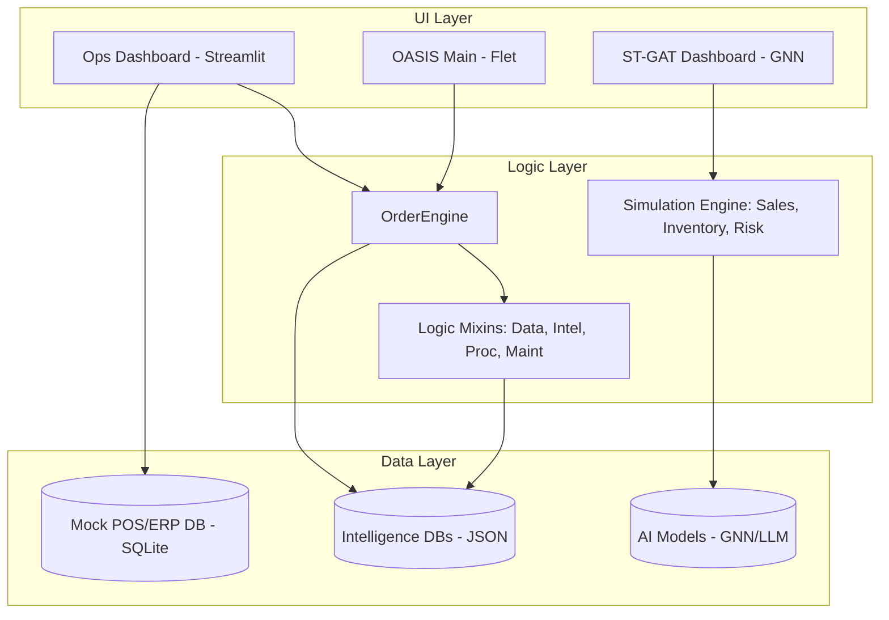

# O.A.S.I.S. Architecture Overview

Welcome to the **Optimized Acquisition & Stock Intelligence System (O.A.S.I.S.)**. This document outlines the high-level architecture and relationships between the various components of the system.

## System Map

## Core Components

- **[[Core_Logic_System|OrderEngine & Mixins]]**: The brain of the system, handling data ingestion, intelligence calculation, and replenishment logic.
- **[[App_Ecosystem|Application Ecosystem]]**: A suite of tools for different operational needs, including real-time monitoring and GNN-based market analysis.
- **[[Operations_Launcher_Guide|Operations Launcher Guide]]**: Detailed breakdown of all system entry points and launchers.
- **[[Simulation_Lab|Simulation Engine]]**: A Sandbox for stress-testing supply chains against "Black Swan" events and volatility.

## Deep Dive Breakdowns
- **[[Oasis_Ordering_Logic|Ordering Logic Breakdown]]**: Line-by-line analysis of the replenishment engine.
- **[[Oasis_Approval_Dashboard_Logic|Approval Dashboard Logic]]**: Forensic breakdown of the PO approval workflow.
- **[[Oasis_Allocation_Logic|Allocation Engine Logic]]**: Logic governing multi-store stock distribution.
- **[[OASIS_Ecosystem_Deep_Dive|O.A.S.I.S. Ecosystem Deep Dive]]**: Comprehensive overview of all interconnected engines and apps.

## Data Flow
1. **Ingestion**: `DataMixin` parses inventory lists (CSV/Excel).
2. **Analysis**: `IntelligenceMixin` calculates velocity and matches SKUs against historical forecasting.
3. **Action**: `ProcurementMixin` generates recommended order quantities based on ROP (Reorder Point) models.
4. **Validation**: The `Simulation Engine` runs what-if scenarios to validate the robustness of the generated orders.
