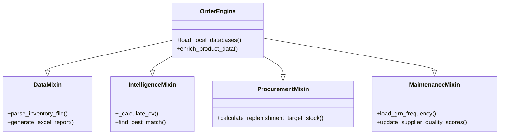

# Core Logic System

The core of O.A.S.I.S. is built on a modular Mixin architecture centered around the `OrderEngine`.

## OrderEngine Structure

The `OrderEngine` (located in `oasis/logic/order_engine.py`) achieves its functionality by inheriting from four specialized Mixins:

### Components Roles:

- **DataMixin**: Standardizes input from fragmented retail sources.
- **IntelligenceMixin**: Provides "Stock Intelligence" by analyzing volatility (CV) and normalized demand.
- **ProcurementMixin**: Maps intelligence to physical acquisition steps (PO generation).
- **MaintenanceMixin**: Handles the metadata layer (Supplier performance, lead times, GRN cycles).

## Forensic Intelligence Engines
The system's decision-making is augmented by four specialized forensic engines that act as logical filters during the replenishment cycle.

| Engine | Name | Primary Role | Key Metric |
| :--- | :--- | :--- | :--- |
| **AMIT** | Assortment & Margin Integration | Gatekeeper for GMROI and capital efficiency. | `Dept_Cap_Utilization` |
| **LATA** | Lead-Time & Allocation Shield | Protects against supplier variance and delivery failures. | `GRN_LeadTime_Variance` |
| **DHARAM** | Demand, Halo & Revenue Analytics | Patches "Ghost Demand" and protects basket affinity. | `Neural_Recovery_Multiplier` |
| **MANDE** | Market, Network & Distribution | Manages supplier delisting and distribution efficiency. | `Trapped_Capital_Days` |

### Engine Interaction (Convergence)
These engines interact in a "Logical Negotiation":
1. **DHARAM** corrects the base demand (ADS).
2. **LATA** applies a safety buffer based on supplier risk.
3. **AMIT** filters the results against margin targets and budget caps.
4. **MANDE** flags risky suppliers for total exclusion.

## Key Logic: The Reorder Point (ROP)
The system uses a seasonality-aware ROP model:
`ROP = (LeadTime + SafetyDays) * AdjustedSalesRate`
- `AdjustedSalesRate` accounts for seasonality, weekend loading (for fresh items), and recent trends.

## Mosaic Orchestration
The system is unified by the **Mosaic Orchestrator**, which ensures that all engines and UI nodes (FastAPI, Next.js, Streamlit) are synchronized. It manages the `shadow_monitor` daemon to maintain high availability and resource integrity across the multi-node architecture.

## Detailed Logic Breakdowns
- [[Oasis_Ordering_Logic|Full Ordering Pipeline Breakdown]]
- [[Oasis_Allocation_Logic|Allocation & Distribution Logic]]
- [[Oasis_Approval_Dashboard_Logic|Approval Center Forensic Logic]]

[[Architecture_Overview|Back to Overview]]
