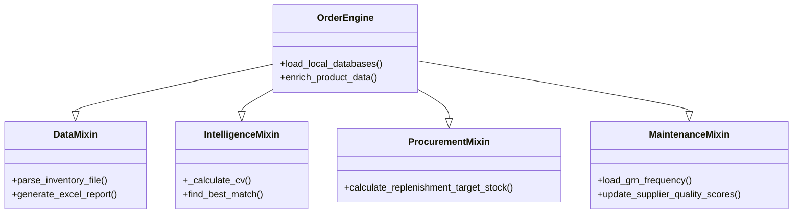

# Core Logic System

The core of O.A.S.I.S. is built on a modular Mixin architecture centered around the `OrderEngine`.

## OrderEngine Structure

The `OrderEngine` (located in `oasis/logic/order_engine.py`) achieves its functionality by inheriting from four specialized Mixins:

### Components Roles:

- **DataMixin**: Standardizes input from fragmented retail sources.
- **IntelligenceMixin**: Provides "Stock Intelligence" by analyzing volatility (CV) and normalized demand.
- **ProcurementMixin**: Maps intelligence to physical acquisition steps (PO generation).
- **MaintenanceMixin**: Handles the metadata layer (Supplier performance, lead times, GRN cycles).

## Key Logic: The Reorder Point (ROP)
The system uses a seasonality-aware ROP model:
`ROP = (LeadTime + SafetyDays) * AdjustedSalesRate`
- `AdjustedSalesRate` accounts for seasonality, weekend loading (for fresh items), and recent trends.

[[Architecture_Overview|Back to Overview]]
